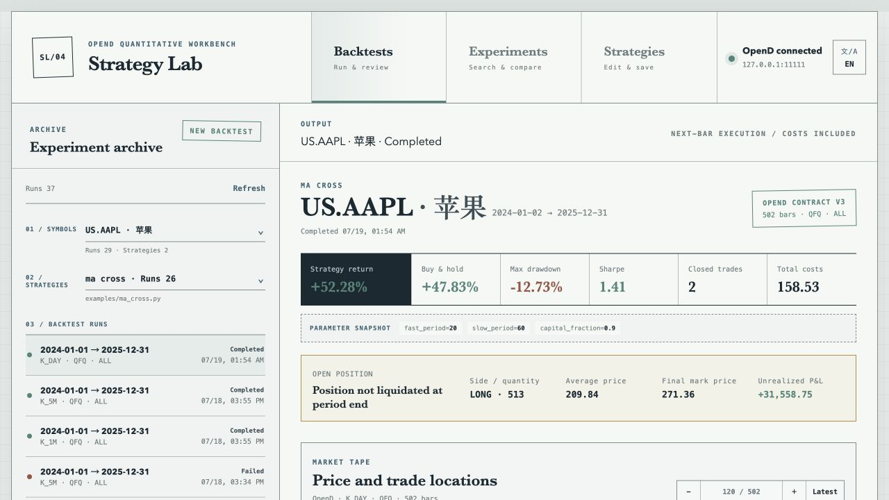

# Strategy Lab

**A local-first stock strategy editor, experiment lab, and backtesting workbench powered by Futu OpenD.**

[简体中文](README.zh-CN.md) · [Architecture](docs/ARCHITECTURE.md) · [Futu compatibility](docs/FUTU_COMPATIBILITY.md)

[](https://github.com/hengistchan/stock-strategy/actions/workflows/ci.yml)
[](LICENSE)
[](backend/pyproject.toml)
[](frontend/package.json)



Strategy Lab connects directly to a local OpenD instance, runs Python stock strategies in isolated backtest processes, and keeps every result reproducible through JSON, CSV, and SVG artifacts. It does not access trading accounts or place live orders.

## What you can do

| | Capability | Description |
| --- | --- | --- |
| 📈 | **Backtest** | Run stock strategies against OpenD OHLCV data with costs, slippage, drawdown, and trade-level results. |
| 🧪 | **Experiment** | Compare parameter grids on a shared market-data cache and rank candidates by return, Sharpe, or drawdown. |
| ✍️ | **Build strategies** | Create, edit, validate, save, and reuse Python strategies from the browser. |
| 🔌 | **Use OpenD directly** | Search US/HK stocks, resolve names, and request paginated historical K-lines without a web-data fallback. |

## Quick start

Requirements: Python 3.11+, Node.js 22+, npm 11+, and OpenD listening on `127.0.0.1:11111`.

```bash
git clone https://github.com/hengistchan/stock-strategy.git
cd stock-strategy
make install
make serve
```

Open [http://127.0.0.1:8000/backtests](http://127.0.0.1:8000/backtests).

The workbench also provides stable routes for `/experiments` and `/strategies`. To run the deterministic sample without OpenD:

```bash
.venv/bin/python -m stock_strategy \
  --strategy examples/ma_cross.py \
  --sample
```

## Project layout

```text
frontend/                  React + TypeScript workbench
backend/stock_strategy/    FastAPI, OpenD adapter, and backtest engine
examples/                  Read-only strategy examples
strategies/                User-editable strategies
docs/                      Architecture, compatibility, and acceptance notes
```

## Development

```bash
make test
make acceptance
```

OpenD integration never silently falls back to simulated or third-party web data. Backtest semantics and supported Futu stock APIs are documented in [FUTU_COMPATIBILITY.md](docs/FUTU_COMPATIBILITY.md).

## Contributing

Issues and pull requests are welcome. Read [CONTRIBUTING.md](CONTRIBUTING.md), follow the [Code of Conduct](CODE_OF_CONDUCT.md), and report vulnerabilities privately through [SECURITY.md](SECURITY.md).

Strategy Lab is a research tool, not investment advice. The Web service is local-only by default, and strategy files should be treated as trusted executable Python code.

## License

[MIT](LICENSE)
